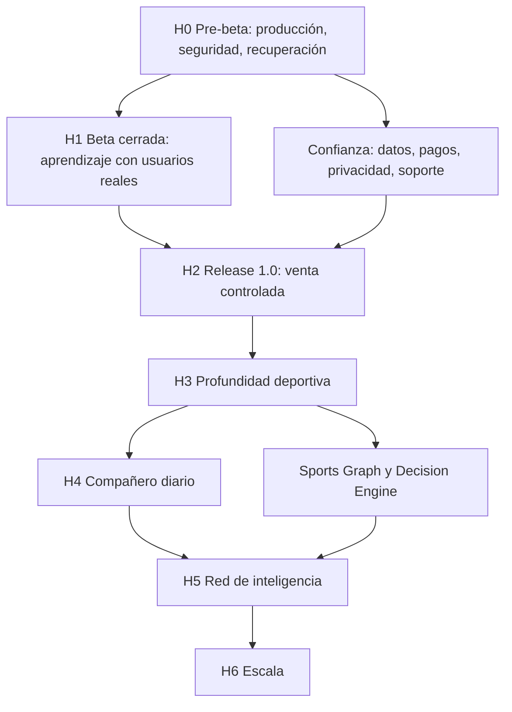

# NeMeSiS Living Roadmap

## Resumen ejecutivo

Este documento es la fuente única de verdad para el futuro de NeMeSiS SHARK PRO. Integra la visión maestra, la estrategia de producto, la filosofía, el roadmap, el TOP 100, el TOP 500, el programa beta y el plan de release en una sola cartera viva de objetivos.

La regla principal es simple: ninguna idea entra en desarrollo si no aparece aquí, si no tiene dependencias claras y si no explica el valor para el usuario y para el negocio. Los documentos anteriores no se eliminan; quedan como fuentes de contexto y evidencia. La priorización activa vive aquí.

Estado del documento: ACTIVO  
Fecha de creación: 2026-07-29  
Alcance: producto, beta, release, deportes, SHARK, usuario, Telegram, bankroll, empresa, operaciones, UX, inteligencia, pasarela deportiva, developer, escalabilidad, seguridad, marketing, comunidad e integraciones.  
Producción modificada: no  
Funcionalidad desarrollada: no

## Fuentes integradas

| Código | Documento | Uso dentro de este roadmap |
|---|---|---|
| MV | `NEMESIS_MASTER_VISION.md` | Norte de varios años, identidad y apuestas estratégicas. |
| PS | `PRODUCT_STRATEGY.md` | Posicionamiento, membresías, diferenciación y reglas de inversión. |
| PH | `PRODUCT_PHILOSOPHY.md` | Principios de experiencia, datos, SHARK, Telegram, bankroll y empresa. |
| MR | `MASTER_ROADMAP.md` | Horizontes H0 a H6 y gates de avance. |
| T100 | `reports/TOP_100_IMPROVEMENTS.md` | Mejoras de mayor impacto para beta y Release 1.0. |
| T500 | `TOP_500_PRODUCT_IDEAS.md` | Banco amplio de ideas consolidado por áreas y familias de necesidad. |
| BP | `reports/BETA_PROGRAM.md` | Objetivos, métricas, fases y guardrails de beta cerrada. |
| RP | `reports/COMMERCIAL_RELEASE_PLAN.md`, `reports/RELEASE_1_CERTIFICATION_REPORT.md`, `reports/GO_TO_MARKET_CHECKLIST.md`, `reports/READY_FOR_CLOSED_BETA.md` | Condiciones comerciales, gates de lanzamiento y bloqueos reales de release. |

## Regla de autoridad

1. Este documento decide qué se trabaja después.
2. El TOP 100 y el TOP 500 dejan de ser backlogs ejecutables directos y pasan a ser fuentes consolidadas.
3. Las ideas equivalentes se fusionan en un objetivo vivo con un único ID.
4. Si una idea nueva aparece en el futuro, debe añadirse aquí antes de planificarse.
5. Si un objetivo cambia de prioridad, debe actualizarse aquí y conservar la razón.
6. Si una dependencia no está resuelta, el objetivo no puede entrar en desarrollo.
7. Ningún objetivo puede prometer datos, métricas, ingresos, resultados deportivos o aprendizaje que no estén certificados.

## Objetivo activo actual

Objetivo activo unico: `LRM-001`  
Nombre operativo: GO TO MARKET & RELEASE 1.0  
Estado actual: IN_PROGRESS  
Regla de gobierno: no se autoriza iniciar ningun otro objetivo LRM hasta que `LRM-001` quede oficialmente cerrado con evidencia.

`LRM-001` agrupa temporalmente los gates reales que impiden pasar de producto tecnicamente preparado a beta cerrada operativa: Git limpio, Render, Cron, Master Tick, persistencia, restore, Telegram controlado, Stripe test, observabilidad, logs, operaciones, Founder Mode, Operations Center, Developer Center, Company Board, Release Readiness, Browser QA, Sentinel, Privacy Guard y Secret Guard.

## Estados permitidos

| Estado | Significado |
|---|---|
| NO INICIADO | Existe como objetivo, pero no hay trabajo abierto. |
| DISEÑO | Requiere especificación de producto antes de desarrollo. |
| LISTO PARA SPRINT | Puede entrar en desarrollo cuando la dirección lo autorice. |
| EN VALIDACIÓN | Implementado localmente o preparado, pendiente de QA completa o evidencia real. |
| BETA PENDIENTE | Necesita usuarios reales para validar valor. |
| BLOQUEADO | No puede avanzar por dependencia, acceso, datos, legal, seguridad o decisión humana. |
| CERTIFICADO | Cumple criterios con evidencia y puede considerarse base estable. |
| DESCARTADO | La idea queda fuera por bajo valor, alto riesgo o contradicción con la filosofía. |

## Prioridades

| Prioridad | Definición |
|---|---|
| P0 | Impide beta, lanzamiento, seguridad, datos, pagos, recuperación o confianza. |
| P1 | Alto impacto para activación, retención, conversión, estabilidad o diferenciación. |
| P2 | Mejora importante con alternativa disponible o impacto acotado. |
| P3 | Pulido, eficiencia, claridad o mejora incremental. |
| P4 | Exploración futura o apuesta de largo plazo. |

## Navegación rápida

- [H0: cierre pre-beta](#h0-cierre-pre-beta)
- [H1: beta cerrada](#h1-beta-cerrada)
- [H2: Release 1.0](#h2-release-10)
- [H3: profundidad deportiva](#h3-profundidad-deportiva)
- [H4: compañero diario](#h4-compañero-diario)
- [H5: red de inteligencia](#h5-red-de-inteligencia)
- [H6: escala](#h6-escala)
- [Duplicados fusionados](#duplicados-fusionados)
- [Dependencias maestras](#dependencias-maestras)
- [Reglas de mantenimiento](#reglas-de-mantenimiento)

## H0: cierre pre-beta

Objetivo: eliminar bloqueos reales y dejar NeMeSiS preparado para primeros usuarios controlados.

| ID | Área | Objetivo | Estado | Prioridad | Impacto usuario | Impacto negocio | Dependencias | Dificultad | Fecha | Versión objetivo | Documentación relacionada |
|---|---|---|---|---|---|---|---|---|---|---|---|
| LRM-001 | Operaciones | Certificar Render, runtime, salud, SHA servido y logs con evidencia read-only. | IN_PROGRESS | P0 | Evita que usuarios entren en una produccion no verificada. | Reduce riesgo reputacional de lanzamiento. | Git limpio, Render read-only actual, Cron, Master Tick, persistencia, restore, Telegram controlado, Stripe test, observabilidad, QA, RP | Media | 2026-07-29 | Pre-beta | RP, MR, T100, `reports/LRM_001_GO_TO_MARKET_RELEASE_1_EXECUTION.md` |
| LRM-002 | Operaciones | Certificar Cron y Master Tick con ejecución protegida, trazabilidad y estado real. | BLOQUEADO | P0 | Asegura datos y automatizaciones frescas. | Evita operación manual opaca. | LRM-001, secretos sin revelar | Alta | 2026-07-29 | Pre-beta | RP, BP, MR |
| LRM-003 | Recuperación | Ejecutar restore drill seguro en entorno aislado y documentar RTO/RPO real. | BLOQUEADO | P0 | Protege cuentas, preferencias y datos de uso. | Reduce riesgo de pérdida de negocio. | Backup válido, entorno aislado | Alta | 2026-07-29 | Pre-beta | RP, MR |
| LRM-004 | Seguridad | Confirmar Secret Guard, Privacy Guard, rutas admin y endpoints protegidos antes de beta. | EN VALIDACIÓN | P0 | Reduce exposición de datos y acciones peligrosas. | Evita incidentes legales y reputacionales. | QA local, RP | Media | 2026-07-29 | Pre-beta | RP, T100 |
| LRM-005 | Telegram | Hacer prueba controlada de entrega Telegram sin spam y sin datos sensibles. | BLOQUEADO | P0 | Verifica que la promesa de alertas existe. | Habilita valor premium sin riesgo de envío incorrecto. | Canal test, autorización humana | Media | 2026-07-29 | Pre-beta | RP, PS, PH |
| LRM-006 | Stripe | Certificar checkout y webhook en modo test, sin cobros reales. | BLOQUEADO | P0 | Evita pagos fallidos o membresías incorrectas. | Permite venta controlada. | Stripe test, firmas, RP | Alta | 2026-07-29 | Pre-beta | RP, PS |
| LRM-007 | Observabilidad | Unificar gate de salud: Render, DB, Cron, Telegram, Stripe, Sentinel y release. | NO INICIADO | P1 | Evita fallos silenciosos. | Permite operar sin revisar diez sitios. | LRM-001 a LRM-006 | Media | 2026-07-29 | Pre-beta | MR, RP, T100 |
| LRM-008 | GitHub | Mantener flujo main simple con backup previo, checks y rollback documentado. | EN VALIDACIÓN | P1 | Reduce errores de despliegue indirectos. | Hace sostenible la operación con equipo pequeño. | Reglas GitHub, checks | Baja | 2026-07-29 | Pre-beta | MR, RP |
| LRM-009 | QA | Convertir Browser QA, Sentinel, rutas, enlaces, privacidad y secretos en gate mínimo de release. | LISTO PARA SPRINT | P1 | Evita regresiones visibles antes de usuarios reales. | Baja coste de soporte. | Herramientas QA existentes | Media | 2026-07-29 | Pre-beta | T100, RP |
| LRM-010 | Soporte | Documentar soporte beta, límites conocidos, contacto, cancelación y recuperación de acceso. | LISTO PARA SPRINT | P1 | El usuario sabe qué hacer si algo falla. | Evita abandono por confusión. | BP, RP | Baja | 2026-07-29 | Pre-beta | BP, RP |

## H1: beta cerrada

Objetivo: aprender con usuarios reales sin prometer más de lo certificado.

| ID | Área | Objetivo | Estado | Prioridad | Impacto usuario | Impacto negocio | Dependencias | Dificultad | Fecha | Versión objetivo | Documentación relacionada |
|---|---|---|---|---|---|---|---|---|---|---|---|
| LRM-011 | Usuario | Primer valor en menos de 60 segundos: encontrar partido, entender contexto y guardar interés. | DISEÑO | P1 | Reduce abandono inicial. | Mejora activación y retención temprana. | LRM-001, calendario estable | Media | 2026-07-29 | Beta cerrada | T100, BP, PS |
| LRM-012 | Onboarding | Onboarding breve, contextual y no invasivo para FREE, PRO y ELITE. | DISEÑO | P1 | Explica sin frenar el uso. | Mejora conversión sin presión. | LRM-011 | Media | 2026-07-29 | Beta cerrada | BP, PS, PH |
| LRM-013 | Conversión | Vista responsable del valor PRO y ELITE basada en casos reales, no promesas. | DISEÑO | P1 | Ayuda a elegir plan con confianza. | Mejora monetización ética. | LRM-006, datos reales | Media | 2026-07-29 | Beta cerrada | PS, RP, T100 |
| LRM-014 | Feedback | Recoger feedback beta sobre claridad, valor, errores y confianza sin datos innecesarios. | LISTO PARA SPRINT | P1 | El usuario participa en mejorar el producto. | Prioriza mejoras reales. | User Privacy, BP | Baja | 2026-07-29 | Beta cerrada | BP, PS |
| LRM-015 | Métricas | Medir primer partido abierto, primer SHARK entendido, primer favorito y retorno diario. | LISTO PARA SPRINT | P1 | Permite mejorar lo que realmente cuesta usar. | Crea lectura objetiva de activación. | LRM-014, privacidad | Media | 2026-07-29 | Beta cerrada | BP, RP |
| LRM-016 | Soporte | Clasificar incidencias beta por P0/P1/P2/P3 y tiempo de resolución. | NO INICIADO | P1 | Respuesta más rápida a problemas reales. | Crea disciplina operacional. | LRM-010 | Baja | 2026-07-29 | Beta cerrada | BP, MR |
| LRM-017 | UX | Reducir clics hasta partido, SHARK, favoritos, membresías y soporte. | DISEÑO | P1 | Menos esfuerzo cognitivo. | Mejora retención y ventas. | Browser QA, TOP 100 | Media | 2026-07-29 | Beta cerrada | T100, PH |
| LRM-018 | Comunidad | Crear grupo beta controlado con expectativas, normas y canal de aprendizaje. | NO INICIADO | P2 | Da sensación de acompañamiento. | Genera evidencia cualitativa. | LRM-014, soporte | Baja | 2026-07-29 | Beta cerrada | BP, PS |
| LRM-019 | Marketing | Mensaje beta: claridad, datos reales y juego responsable como diferenciadores. | DISEÑO | P2 | Entiende qué es NeMeSiS sin exageración. | Mejora confianza inicial. | PS, PH | Baja | 2026-07-29 | Beta cerrada | PS, RP |
| LRM-020 | Empresa | Panel de seguimiento beta con usuarios, feedback, bloqueos y decisión GO/NO-GO. | EN VALIDACIÓN | P1 | No afecta directamente, pero protege experiencia. | Permite decidir con evidencia. | Company Board, Founder Mode | Media | 2026-07-29 | Beta cerrada | BP, RP |

## H2: Release 1.0

Objetivo: vender de forma controlada solo cuando producción, pagos, soporte, medición y valor estén certificados.

| ID | Área | Objetivo | Estado | Prioridad | Impacto usuario | Impacto negocio | Dependencias | Dificultad | Fecha | Versión objetivo | Documentación relacionada |
|---|---|---|---|---|---|---|---|---|---|---|---|
| LRM-021 | Release | Declarar Release Candidate solo con Render, Cron, Stripe, Telegram, persistencia y UX en PASS. | BLOQUEADO | P0 | Evita comprar un producto no preparado. | Protege lanzamiento público. | LRM-001 a LRM-010 | Alta | 2026-07-29 | Release 1.0 | RP, MR |
| LRM-022 | Membresías | Certificar diferencias reales FREE, PRO y ELITE con ejemplos verificables. | DISEÑO | P1 | El usuario entiende qué paga. | Reduce churn y soporte comercial. | LRM-013, LRM-015 | Media | 2026-07-29 | Release 1.0 | PS, RP |
| LRM-023 | Track record | Mostrar metodología, muestra, limitaciones y resultados reales de picks cerrados. | DISEÑO | P1 | Genera confianza sin prometer beneficio. | Base de venta premium. | Datos históricos certificados | Alta | 2026-07-29 | Release 1.0 | T100, PH |
| LRM-024 | Pagos | Flujo completo checkout, webhook, activación, cancelación y error seguro. | BLOQUEADO | P0 | Evita pérdida de funciones pagadas. | Reduce riesgo económico y legal. | LRM-006 | Alta | 2026-07-29 | Release 1.0 | RP, PS |
| LRM-025 | Soporte comercial | FAQ, contacto, bajas, reembolsos y límites del servicio claros. | LISTO PARA SPRINT | P1 | Reduce incertidumbre antes de pagar. | Reduce fricción de venta. | LRM-010 | Baja | 2026-07-29 | Release 1.0 | RP, BP |
| LRM-026 | Go to market | Checklist público: oferta, pricing, términos, privacidad, soporte, métricas y riesgos. | NO INICIADO | P1 | Compra con información suficiente. | Lanza con control. | LRM-021 a LRM-025 | Media | 2026-07-29 | Release 1.0 | RP, PS |
| LRM-027 | Rendimiento | Mantener tiempos de pantallas clave bajo objetivos definidos con medición continua. | EN VALIDACIÓN | P1 | Producto más rápido y fiable. | Mejora conversión y reduce coste. | Browser QA, observabilidad | Media | 2026-07-29 | Release 1.0 | T100, MR |
| LRM-028 | Accesibilidad | Certificar contraste, navegación móvil, foco, tamaños y textos en pantallas críticas. | NO INICIADO | P2 | Producto usable por más personas. | Mejora calidad comercial. | UX QA | Media | 2026-07-29 | Release 1.0 | T100, PH |
| LRM-029 | Legal | Revisar juego responsable, edad, disclaimers, privacidad y uso de datos deportivos. | BLOQUEADO | P0 | Reduce riesgo de mensajes engañosos. | Reduce riesgo legal. | Revisión legal humana | Alta | 2026-07-29 | Release 1.0 | PH, RP |
| LRM-030 | Analítica | Medir conversión FREE a PRO a ELITE sin inventar tasas ni usar datos invasivos. | NO INICIADO | P1 | Personalización más honesta. | Permite decidir pricing y oferta. | LRM-015, privacidad | Media | 2026-07-29 | Release 1.0 | BP, PS |

## H3: profundidad deportiva

Objetivo: convertir NeMeSiS en una experiencia deportiva superior, no en una lista de datos.

| ID | Área | Objetivo | Estado | Prioridad | Impacto usuario | Impacto negocio | Dependencias | Dificultad | Fecha | Versión objetivo | Documentación relacionada |
|---|---|---|---|---|---|---|---|---|---|---|---|
| LRM-031 | Sports | Consolidar descubrimiento de partidos por contexto, filtros, favoritos y rapidez. | EN VALIDACIÓN | P1 | Encuentra cualquier partido con menos esfuerzo. | Aumenta uso recurrente. | Calendario, Sports Core | Media | 2026-07-29 | Post 1.0 | MV, MR, T500 |
| LRM-032 | Match Center | Profundizar resumen, estado, cronología, evidencia, frescura y contexto del partido. | EN VALIDACIÓN | P1 | Entiende un partido en segundos. | Diferenciación frente a apps genéricas. | Sports Core, Match Intelligence | Alta | 2026-07-29 | Post 1.0 | MV, T500 |
| LRM-033 | Team Center | Evolucionar centro de equipo con forma, rivales, competición y contexto verificable. | EN VALIDACIÓN | P1 | Sigue clubes con más claridad. | Incrementa sesiones repetidas. | Sports Graph, Team Knowledge | Alta | 2026-07-29 | Post 1.0 | T500, MR |
| LRM-034 | Competition Center | Profundizar competición con tabla, calendario, objetivos y lectura de temporada. | EN VALIDACIÓN | P1 | Comprende ligas y torneos rápidamente. | Aumenta cobertura premium. | Competition Knowledge | Alta | 2026-07-29 | Post 1.0 | T500, MR |
| LRM-035 | Player Center | Completar identidad deportiva del jugador con eventos, equipo, contexto y disponibilidad. | EN VALIDACIÓN | P2 | Sigue protagonistas reales. | Abre nuevas superficies de interés. | Player Entity, Sports Graph | Alta | 2026-07-29 | Post 1.0 | T500, MR |
| LRM-036 | Live Center | Crear directo centrado en cambios relevantes, calidad de datos y explicación de eventos. | DISEÑO | P1 | No necesita refrescar varias apps. | Aumenta hábito diario. | Timeline, Gateway, freshness | Alta | 2026-07-29 | Post 1.0 | T500, MV |
| LRM-037 | Sports Hub | Agrupar competiciones, favoritos, directos, próximos partidos y contexto SHARK. | DISEÑO | P2 | Entrada deportiva más clara. | Mejora retención. | LRM-031 a LRM-036 | Alta | 2026-07-29 | Post 1.0 | T500, MR |
| LRM-038 | Favoritos | Convertir favoritos en seguimiento activo con contexto, próximos partidos y cambios. | DISEÑO | P1 | Vuelve por sus equipos y competiciones. | Aumenta recurrencia. | User Intelligence, Sports Graph | Media | 2026-07-29 | Post 1.0 | T500, BP |
| LRM-039 | Buscador | Búsqueda global por partido, equipo, competición, jugador y módulo. | DISEÑO | P1 | Reduce tiempo hasta información. | Mejora activación y uso profundo. | Sports Graph, permisos | Alta | 2026-07-29 | Post 1.0 | T500, T100 |
| LRM-040 | Datos deportivos | Mostrar siempre calidad, fuente, actualización y limitaciones en módulos deportivos. | LISTO PARA SPRINT | P1 | Confía porque sabe qué está confirmado. | Diferenciación por transparencia. | Gateway, Evidence | Media | 2026-07-29 | Post 1.0 | PH, T500 |

## H4: compañero diario

Objetivo: hacer que NeMeSiS sea útil todos los días sin saturar ni manipular.

| ID | Área | Objetivo | Estado | Prioridad | Impacto usuario | Impacto negocio | Dependencias | Dificultad | Fecha | Versión objetivo | Documentación relacionada |
|---|---|---|---|---|---|---|---|---|---|---|---|
| LRM-041 | Smart Home | Resumen diario personalizado con favoritos, próximos partidos y cambios importantes. | EN VALIDACIÓN | P1 | Sabe qué mirar hoy. | Aumenta uso diario. | User Intelligence, Sports Core | Alta | 2026-07-29 | Post 1.0 | T500, BP |
| LRM-042 | Watchlist | Seguimiento configurable de equipos, competiciones, partidos y jugadores. | EN VALIDACIÓN | P1 | Controla sus intereses sin ruido. | Mejora retención. | LRM-038, privacidad | Media | 2026-07-29 | Post 1.0 | T500 |
| LRM-043 | Alert Center | Alertas con motivo, límite, frescura, dedupe y control del usuario. | EN VALIDACIÓN | P1 | Recibe avisos útiles, no spam. | Aumenta valor premium. | Telegram, User Privacy | Alta | 2026-07-29 | Post 1.0 | T500, PH |
| LRM-044 | Daily Briefing | Briefing diario basado en datos reales y contexto de favoritos. | EN VALIDACIÓN | P2 | Ahorra tiempo cada día. | Refuerza recurrencia. | LRM-041, LRM-042 | Media | 2026-07-29 | Post 1.0 | T500 |
| LRM-045 | Evening Recap | Resumen nocturno de resultados, picks, cambios y pendientes. | EN VALIDACIÓN | P2 | Cierra el día sin buscar manualmente. | Aumenta hábito. | Resultados reales, Telegram opcional | Media | 2026-07-29 | Post 1.0 | T500 |
| LRM-046 | Activity Center | Historial transparente de visitas, favoritos, decisiones y preferencias del usuario. | EN VALIDACIÓN | P2 | Entiende y controla su personalización. | Reduce riesgo de privacidad. | User Intelligence | Media | 2026-07-29 | Post 1.0 | T500, PH |
| LRM-047 | Decision History | Historial de decisiones y evidencia consultada, sin predicciones inventadas. | EN VALIDACIÓN | P2 | Aprende por qué vio cada recomendación. | Refuerza confianza. | Decision Engine | Media | 2026-07-29 | Post 1.0 | T500 |
| LRM-048 | Comunidad | Espacios de aprendizaje responsable y feedback, sin señales de apuesta garantizada. | NO INICIADO | P3 | Siente acompañamiento y pertenencia. | Construye marca y retención. | Moderación, legal | Alta | 2026-07-29 | Post 1.0 | T500, PH |
| LRM-049 | Soporte proactivo | Detectar frustración por errores, bloqueos o pantallas vacías y guiar al usuario. | DISEÑO | P2 | Se recupera antes de abandonar. | Reduce tickets y churn. | Observabilidad UX | Media | 2026-07-29 | Post 1.0 | T100, T500 |
| LRM-050 | Retención | Medir cohortes, retorno, valor percibido y motivos de abandono con consentimiento. | NO INICIADO | P1 | Producto evoluciona según uso real. | Optimiza ingresos sin manipular. | LRM-015, privacidad | Alta | 2026-07-29 | Post 1.0 | BP, PS |

## H5: red de inteligencia

Objetivo: conectar evidencia, contexto, SHARK, decisiones y fuentes sin crear inteligencia ficticia.

| ID | Área | Objetivo | Estado | Prioridad | Impacto usuario | Impacto negocio | Dependencias | Dificultad | Fecha | Versión objetivo | Documentación relacionada |
|---|---|---|---|---|---|---|---|---|---|---|---|
| LRM-051 | SHARK | Explicar qué sabe, qué falta y qué cambió sin parecer chat ni inventar conclusiones. | EN VALIDACIÓN | P1 | Entiende SHARK con confianza. | Diferenciación central del producto. | Match Intelligence, Evidence | Alta | 2026-07-29 | NeMeSiS 2.x | MV, PH, T500 |
| LRM-052 | SHARK | Preparar asistente futuro solo cuando exista evidencia suficiente y límites claros. | DISEÑO | P3 | Recibe ayuda sin confundir opinión con dato. | Abre producto premium futuro. | LRM-051, legal, privacidad | Alta | 2026-07-29 | NeMeSiS 2.x | MV, PH |
| LRM-053 | Picks | Pipeline de picks con cuota, selección, frescura, dedupe, riesgo y muestra suficiente. | EN VALIDACIÓN | P1 | Evita picks opacos o incompletos. | Base de monetización responsable. | Datos reales, track record | Alta | 2026-07-29 | Release 1.0+ | PH, T500 |
| LRM-054 | Bankroll | Bankroll orientativo, responsable y nunca presentado como garantía de beneficio. | DISEÑO | P1 | Gestiona riesgo con claridad. | Reduce riesgo legal y reputacional. | LRM-053, legal | Alta | 2026-07-29 | Release 1.0+ | PH, PS |
| LRM-055 | Telegram | Mensajes premium con valor, contexto, dedupe, límites y variantes por membresía. | EN VALIDACIÓN | P1 | Recibe calidad, no cantidad. | Aumenta valor de pago. | LRM-005, LRM-053 | Alta | 2026-07-29 | Release 1.0+ | PH, PS, T500 |
| LRM-056 | Telegram | Medir rendimiento real de mensajes y picks sin inventar aperturas ni conversiones. | DISEÑO | P2 | Menos ruido y más utilidad. | Mejora oferta premium con evidencia. | LRM-055, analítica permitida | Media | 2026-07-29 | Post 1.0 | T500, BP |
| LRM-057 | Gateway | Registrar fuentes con licencia, uso comercial, atribución, cobertura, salud y calidad. | EN VALIDACIÓN | P0 | Reduce riesgo de datos no permitidos. | Protege escalabilidad legal. | Source Registry | Alta | 2026-07-29 | Release 1.0+ | PH, T500 |
| LRM-058 | Gateway | Aprobar nuevas fuentes solo tras compliance, límites de coste y prueba read-only. | DISEÑO | P1 | Datos más completos sin sorpresas. | Escala cobertura de forma segura. | LRM-057, legal | Alta | 2026-07-29 | NeMeSiS 2.x | T500, MR |
| LRM-059 | Decision Engine | Resolver discrepancias entre fuentes con evidencia, calidad, frescura y limitaciones. | EN VALIDACIÓN | P1 | Sabe cuándo confiar y cuándo esperar. | Reduce decisiones erróneas. | Gateway, Evidence | Alta | 2026-07-29 | NeMeSiS 2.x | MV, T500 |
| LRM-060 | Sports Graph | Relacionar partido, equipo, competición, temporada, jugador, picks, odds y Telegram. | EN VALIDACIÓN | P1 | Navegación conectada y contextual. | Base de producto escalable. | Sports Core | Alta | 2026-07-29 | NeMeSiS 2.x | MV, T500 |

## H6: escala

Objetivo: preparar la empresa para decenas de miles de usuarios sin perder control humano, seguridad ni calidad.

| ID | Área | Objetivo | Estado | Prioridad | Impacto usuario | Impacto negocio | Dependencias | Dificultad | Fecha | Versión objetivo | Documentación relacionada |
|---|---|---|---|---|---|---|---|---|---|---|---|
| LRM-061 | Escalabilidad | Medir qué rompería primero: SQLite, Render, Cron, APIs, Telegram, sesiones o logs. | DISEÑO | P0 | Evita caídas al crecer. | Reduce riesgo de escala prematura. | Observabilidad, carga controlada | Alta | 2026-07-29 | Escala | MR, T500 |
| LRM-062 | Base de datos | Plan de migración futura o particionado solo si métricas lo justifican. | NO INICIADO | P2 | Mantiene estabilidad sin cambios innecesarios. | Evita deuda y coste prematuro. | LRM-061, métricas reales | Alta | 2026-07-29 | Escala | MR, T500 |
| LRM-063 | Backups | Backups versionados, restauración probada, inventario y alerta de backup stale. | BLOQUEADO | P0 | Protege datos del usuario. | Evita pérdida irreversible. | LRM-003 | Alta | 2026-07-29 | Pre-beta | RP, MR |
| LRM-064 | Logs | Logs útiles, sin secretos, con retención, correlación e incidentes rastreables. | DISEÑO | P1 | Fallos se detectan antes. | Reduce tiempo de recuperación. | Privacy Guard | Media | 2026-07-29 | Release 1.0 | T500, MR |
| LRM-065 | Alertas | Alertas accionables por P0/P1, no ruido operativo. | DISEÑO | P1 | Menos caídas prolongadas. | Operación más profesional. | LRM-007, LRM-064 | Media | 2026-07-29 | Release 1.0 | MR, T500 |
| LRM-066 | Developer | Developer Center como tablero real de contratos, QA, rutas, release y salud. | EN VALIDACIÓN | P2 | No visible directo, pero reduce regresiones. | Acelera mantenimiento. | QA, documentación viva | Media | 2026-07-29 | Release 1.0+ | T500, MR |
| LRM-067 | Company | Founder/Company Board como centro de decisión: riesgos, beta, KPIs, roadmap y release. | EN VALIDACIÓN | P1 | Mejores decisiones impactan experiencia. | Dirige empresa con evidencia. | LRM-020, LRM-030 | Media | 2026-07-29 | Beta cerrada | PS, BP |
| LRM-068 | Seguridad | Revisiones periódicas de autenticación, permisos, cron, webhooks, pagos y admin. | LISTO PARA SPRINT | P0 | Protege cuenta y datos. | Reduce riesgo legal. | Secret Guard, Privacy Guard | Alta | 2026-07-29 | Release 1.0 | RP, PH |
| LRM-069 | Privacidad | Panel de datos personales, exportación, borrado, preferencias y desactivación de personalización. | EN VALIDACIÓN | P1 | Controla su información. | Refuerza confianza y cumplimiento. | User Intelligence | Alta | 2026-07-29 | Release 1.0 | PH, T500 |
| LRM-070 | Licencias | Inventario de fuentes, imágenes, logos, datos deportivos y atribuciones. | DISEÑO | P0 | Evita contenido que deba retirarse. | Reduce riesgo legal comercial. | Gateway, revisión legal | Alta | 2026-07-29 | Release 1.0 | T500, PH |
| LRM-071 | Costes | Guardrails de APIs, Telegram, IA futura, almacenamiento, Render y Browser QA. | DISEÑO | P1 | Producto estable incluso con más uso. | Protege margen. | Observabilidad, Gateway | Media | 2026-07-29 | Release 1.0+ | PS, MR |
| LRM-072 | Automatización | Automatizar solo tareas seguras: checks, reportes, detección, prompts y checklist. | EN VALIDACIÓN | P1 | Menos errores humanos. | Escala operación sin perder control. | AutoPilot, aprobación humana | Media | 2026-07-29 | Release 1.0+ | PH, T500 |
| LRM-073 | Incidencias | Runbooks P0/P1 para Render, DB, Cron, Telegram, Stripe, Gateway y privacidad. | LISTO PARA SPRINT | P0 | Recuperación más rápida. | Reduce impacto económico. | LRM-007, LRM-063 | Media | 2026-07-29 | Pre-beta | RP, MR |
| LRM-074 | Calidad | Mantener backlog visual, lingüístico, accesibilidad, rutas, enlaces y navegación. | EN VALIDACIÓN | P1 | Producto más claro y profesional. | Reduce churn por fricción. | Browser QA, Sentinel | Media | 2026-07-29 | Release 1.0 | T100, PH |
| LRM-075 | Marketing | Posicionamiento: inteligencia deportiva con evidencia, no promesas de ganancias. | DISEÑO | P1 | Entiende valor diferencial. | Construye marca defendible. | LRM-029, LRM-053 | Media | 2026-07-29 | Release 1.0 | PS, PH |
| LRM-076 | Comunidad | Programa de usuarios expertos, feedback, entrevistas y casos de uso reales. | NO INICIADO | P3 | El producto mejora con usuarios reales. | Crea defensibilidad de comunidad. | Beta activa | Media | 2026-07-29 | Post 1.0 | BP, T500 |
| LRM-077 | Integraciones | Integraciones futuras solo si pasan compliance, privacidad, coste, valor y rollback. | DISEÑO | P2 | Evita conexiones frágiles. | Reduce deuda operativa. | Gateway, seguridad | Media | 2026-07-29 | NeMeSiS 2.x | T500, PH |
| LRM-078 | IA | IA generativa futura solo con evidencia, privacidad, límites, trazabilidad y aprobación humana. | DISEÑO | P4 | Ayuda sin confundir ni manipular. | Abre nueva línea premium. | LRM-051, LRM-059, legal | Alta | 2026-07-29 | NeMeSiS 2.x | MV, PH |
| LRM-079 | Internacionalización | Preparar formatos, idiomas, moneda, horarios y contenidos por mercado sin dispersión. | NO INICIADO | P3 | Experiencia local cuando crezca. | Expande mercado. | Release 1.0 estable | Alta | 2026-07-29 | NeMeSiS 2.x | PS, T500 |
| LRM-080 | Gobierno de producto | Revisar este roadmap antes de cada sprint y archivar decisiones obsoletas con motivo. | CERTIFICADO | P1 | Evita cambios caprichosos. | Mantiene foco y trazabilidad. | Ninguna | Baja | 2026-07-29 | Permanente | MV, MR, T500 |

## Duplicados fusionados

| Familia fusionada | Ideas equivalentes absorbidas | Objetivos vivos |
|---|---|---|
| Descubrir deporte | Descubrimiento guiado, calendario, búsqueda, favoritos, acceso rápido, filtros, rutas de primer uso. | LRM-011, LRM-017, LRM-031, LRM-038, LRM-039, LRM-041 |
| Confianza en datos | Fuente, evidencia, frescura, calidad, limitaciones, datos ausentes, discrepancias. | LRM-040, LRM-057, LRM-058, LRM-059, LRM-070 |
| Inteligencia deportiva | Match Intelligence, SHARK contextual, Decision Engine, Sports Graph, Sports Knowledge. | LRM-032, LRM-051, LRM-052, LRM-059, LRM-060 |
| Valor premium | Picks, track record, Telegram, bankroll, preview responsable, membresías. | LRM-013, LRM-022, LRM-023, LRM-053, LRM-054, LRM-055 |
| Beta y aprendizaje | Onboarding, feedback, métricas, soporte, comunidad beta, GO/NO-GO. | LRM-011 a LRM-020 |
| Operación segura | Render, Cron, Master Tick, restore, logs, alertas, runbooks, backups. | LRM-001, LRM-002, LRM-003, LRM-007, LRM-063, LRM-064, LRM-065, LRM-073 |
| Privacidad y seguridad | Datos personales, secretos, admin, pagos, webhooks, permisos, legal. | LRM-004, LRM-006, LRM-024, LRM-029, LRM-068, LRM-069 |
| Escala | Coste, automatización, integraciones, base de datos, observabilidad, disponibilidad. | LRM-061, LRM-062, LRM-071, LRM-072, LRM-077 |
| Producto premium | UX, lenguaje, accesibilidad, densidad, navegación, diseño claro. | LRM-028, LRM-049, LRM-074 |
| Empresa | Founder Mode, Company Board, Developer Center, roadmap, KPIs, decisiones. | LRM-020, LRM-066, LRM-067, LRM-080 |

## Dependencias maestras

## Reglas de mantenimiento

1. Cada sprint debe seleccionar un único objetivo vivo o un grupo explícito de objetivos dependientes.
2. No se añade una pantalla, motor, API o integración si su objetivo no está aquí.
3. No se declara PASS si la evidencia es local, parcial o bloqueada por acceso.
4. Los documentos fuente no se editan para cambiar prioridades; se actualiza este roadmap.
5. Las ideas nuevas se añaden como objetivos nuevos solo si no encajan en una familia existente.
6. Si encajan en una familia existente, se actualiza el objetivo vivo y se documenta el cambio.
7. Cada objetivo debe conservar ID estable aunque cambie su estado.
8. Al cerrar un objetivo, se debe añadir evidencia, QA y decisión de producto.
9. Las decisiones con impacto legal, pagos, datos personales, producción o Telegram real requieren aprobación humana.
10. El siguiente sprint recomendado debe salir siempre de los objetivos P0/P1 no certificados.

## Siguiente unica accion recomendada

Cerrar `LRM-001` como objetivo activo unico antes de iniciar cualquier desarrollo nuevo.

Sub-gates obligatorios de `LRM-001`:

1. Git limpio.
2. Render certificado con evidencia read-only actual.
3. Cron y Master Tick certificados.
4. Persistencia y restore certificados de forma segura.
5. Telegram certificado en modo controlado.
6. Stripe certificado en modo test seguro.
7. Observabilidad, logs, Operations Center, Founder Mode, Developer Center y Company Board actualizados.
8. Browser QA, Sentinel, Privacy Guard y Secret Guard en PASS.

Hasta que `LRM-001` no este en READY_FOR_CLOSED_BETA o COMPLETED, la decision responsable es no iniciar otro objetivo LRM.
## Communication System Update - 2026-07-30

Estado: EN VALIDACIÓN LOCAL. El objetivo LRM-055 queda reforzado con un sistema visual común para mensajes Telegram: cabecera NeMeSiS, jerarquía compacta, transparencia, juego responsable y QA de longitud/HTML/mojibake. No cambia envío, cron, dedupe, destinos ni seguridad. Documentación relacionada: `reports/NEMESIS_COMMUNICATION_SYSTEM_REPORT.md`, `reports/TELEGRAM_PREMIUM_MESSAGE_GUIDE.md`, `reports/MESSAGE_STYLE_GUIDE.md`, `reports/COMMUNICATION_QA_REPORT.md`.

## Product Excellence Sprint 01 - 2026-07-30

Objetivos relacionados: LRM-011, LRM-013, LRM-028, LRM-041, LRM-049, LRM-055 y LRM-074. Estado: EN VALIDACION LOCAL. Documentacion relacionada: `reports/TOP100_SPRINT_01_REPORT.md`, `reports/PRODUCT_EXCELLENCE_REPORT.md`, `reports/UX_IMPROVEMENTS_REPORT.md`. No se modifica ningun objetivo posterior ni se reordena el Living Roadmap.

## Product Excellence Sprint 02 - 2026-07-30

Objetivos relacionados: LRM-001, LRM-014, LRM-015, LRM-016, LRM-017, LRM-018 y LRM-020. Estado: EN VALIDACION LOCAL con QA local PASS. Documentacion relacionada: `reports/TOP100_SPRINT_02_REPORT.md`, `reports/PRODUCT_EXCELLENCE_SPRINT_02.md`, `reports/UX_IMPROVEMENTS_SPRINT_02.md`. No se modifica ningun objetivo posterior ni se reordena el Living Roadmap.

## Executive Board - 2026-07-31

Estado: PASS LOCAL. El Consejo de Direccion interno consume exclusivamente la evidencia del Product Review System, emite votos independientes por director, genera Product Score explicable y prioriza un maximo de 10 mejoras para decision humana. No ejecuta mejoras, no crea chatbot, no usa IA generativa, no toca produccion, no hace push y no hace deploy.

| ID | Area | Prioridad | Estado | Voto Board | Coste | Riesgo | Dependencias | Documentacion relacionada |
| --- | --- | --- | --- | --- | --- | --- | --- | --- |
| EBD-003 | copy | P2 | Pendiente | ALTA | Medio | Bajo | Product Review System, aprobacion humana | reports/EXECUTIVE_DECISION_MATRIX.md, reports/STRATEGIC_ROADMAP_REPORT.md, reports/PRODUCT_HEALTH_REPORT.md |
| EBD-001 | copy | P2 | Pendiente | ALTA | Medio | Bajo | Product Review System, aprobacion humana | reports/EXECUTIVE_DECISION_MATRIX.md, reports/STRATEGIC_ROADMAP_REPORT.md, reports/PRODUCT_HEALTH_REPORT.md |
| EBD-002 | copy | P2 | Pendiente | ALTA | Medio | Bajo | Product Review System, aprobacion humana | reports/EXECUTIVE_DECISION_MATRIX.md, reports/STRATEGIC_ROADMAP_REPORT.md, reports/PRODUCT_HEALTH_REPORT.md |
| EBD-004 | navigation | P2 | Pendiente | ALTA | Bajo | Medio | Product Review System, aprobacion humana | reports/EXECUTIVE_DECISION_MATRIX.md, reports/STRATEGIC_ROADMAP_REPORT.md, reports/PRODUCT_HEALTH_REPORT.md |
| EBD-005 | Seguridad | P3 | Pendiente | MEDIA | Bajo | Medio | Product Review System, aprobacion humana | reports/EXECUTIVE_DECISION_MATRIX.md, reports/STRATEGIC_ROADMAP_REPORT.md, reports/PRODUCT_HEALTH_REPORT.md |

## Company Platform Business Ecosystem - 2026-07-31

Objetivo relacionado: LRM-026 Go to market. Estado local: EN VALIDACION. Se crea infraestructura publica para explicar NeMeSiS, precios, ayuda, conocimiento, roadmap, estado, partners, afiliados y blog sin pagos, campanas, contenido ficticio ni nuevas fuentes. Documentacion relacionada: `reports/COMPANY_PLATFORM_REPORT.md`, `reports/BUSINESS_READY_REPORT.md`, `reports/COMMERCIAL_WEBSITE_REPORT.md`, `reports/GO_TO_MARKET_PLATFORM.md`.

## Go To Market Program - 2026-07-31

Objetivo relacionado: LRM-001 Go to Market & Release 1.0. Estado local: EN VALIDACION. El Go To Market Office consolida beta, lanzamiento, marketing, conversion, soporte, operaciones, checklist y Top 20 con evidencia local. No modifica objetivos posteriores, no ejecuta campanas, no registra usuarios reales, no conecta pagos y no certifica produccion.

Documentacion relacionada: `reports/GO_TO_MARKET_OFFICE_REPORT.md`, `reports/BETA_MANAGEMENT_REPORT.md`, `reports/COMMERCIAL_READINESS_FINAL.md`, `reports/CUSTOMER_SUCCESS_REPORT.md`, `reports/MARKETING_FOUNDATION_REPORT.md`, `reports/LAUNCH_CHECKLIST_FINAL.md`, `reports/TOP20_RELEASE_ACTIONS.md`.
